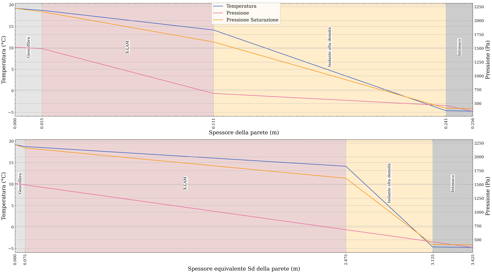
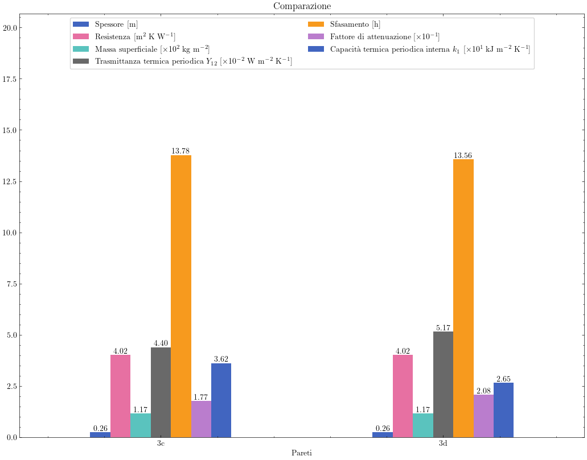

## Usage:
After importing
```
from thermo_hygrometric.wall_layer import Layer
from thermo_hygrometric.wall_compound import Wall
```

Create the Layers of the compund wall
```
gessofibra = Layer(
    name="Gessofibra",
    thickness=0.015,
    thermal_conductivity=0.21,
    vapor_permeability=5.0,
    density=1150,
    specific_heat=1100,
)
xlam = Layer(
    name="X-LAM",
    thickness=0.096,
    thermal_conductivity=0.13,
    vapor_permeability=25.0,
    density=500.0,
    specific_heat=1600,
)
isolante = Layer(
    name="Isolante alta densità",
    thickness=0.13,
    thermal_conductivity=0.043,
    vapor_permeability=5.0,
    density=190,
    specific_heat=2100,
)
intonaco = Layer(
    name="Gessofibra",
    thickness=0.015,
    thermal_conductivity=0.9,
    vapor_permeability=20,
    density=1800,
    specific_heat=1000,
)
```
Then add them to a Wall 
```
wall_3c = Wall(name="3c", layers=[gessofibra, xlam, isolante, intonaco])
```
Finally, for example:
```
print(wall_3c.calc_trasmittanza_termica_periodica())
```
gives `0.04397424174344255`

or to get a Glaser diagram:
```
fig, axs = wall_3c.plot_glaser()
plt.show()
```



### Plotting a comparasion between two Walls:
```
plt.style.use(['science' , 'retro']) # not really needed
from thermo_hygrometric.utils import plot_bar_chart_comparasion

wall_3c = Wall(name="3c", layers=[gessofibra, xlam, isolante, intonaco])
wall_3d = Wall(name="3d", layers=[gessofibra, isolante, xlam, intonaco])
plot_bar_chart_comparasion([wall_3c, wall_3d], latex=True)
plt.show()
```

